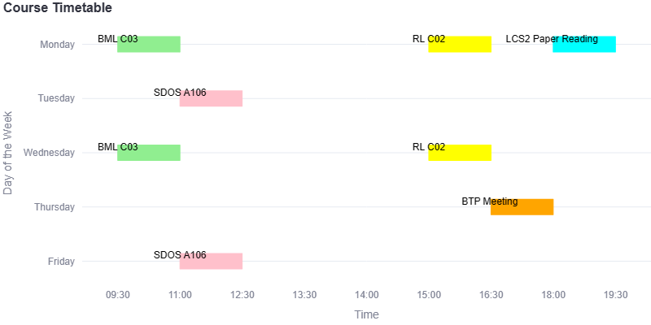

# Course Timetable App

The Course Timetable App is a Streamlit web application designed to help students generate personalized timetables based on the courses they are taking. With this app, students can input the courses they are enrolled in, and the app will create a customized timetable for them, displaying the class schedule for each day of the week.

Note: The data may be error prone, please report any errors you find and don't blame me if you miss a class because of this app xD

Sample Timetable:



## Getting Started

To run the Course Timetable App locally, follow the steps below:

### Prerequisites

Make sure you have Python 3.x installed on your machine.

### Installation

1. Clone this repository to your local machine:

   ```bash
   git clone https://github.com/aflah02/IIITD-TT-Builder.git
   cd course-timetable-app
   ```

2. Install the required dependencies using pip:

   ```bash
   pip install -r requirements.txt
   ```

### Usage

1. Run the Streamlit app locally:

   ```bash
   streamlit run main.py
   ```

2. The app will open in your default web browser. You can interact with the app through the browser interface.

### How to Use

1. Choose the courses you are enrolled in from the multi-select dropdown menu.

2. Click the "Generate Timetable" button to create your personalized timetable.

3. The timetable will be displayed on the page, showing the schedule for each day of the week based on the courses you entered.

4. You can change the course details and click "Generate Timetable" again to update your timetable as needed.

### Note

- The app is designed to handle courses for Monsoon 2023 currently. If you want to use the app for a different semester, you will need to update the course details in the file starting with `courseDB_` and the file starting with `slotsMapping` in the `data` folder.

## Contributing

Contributions to the Course Timetable App are welcome. If you find any bugs or have suggestions for improvements, feel free to open an issue or submit a pull request.

## License

The Course Timetable App is open-source and distributed under the [MIT License](https://opensource.org/licenses/MIT).

## Contact

If you have any questions or feedback, you can reach out to me at [aflah20082@iiitd.ac.in](mailto:aflah20082@iiitd.ac.in)

Happy scheduling!
